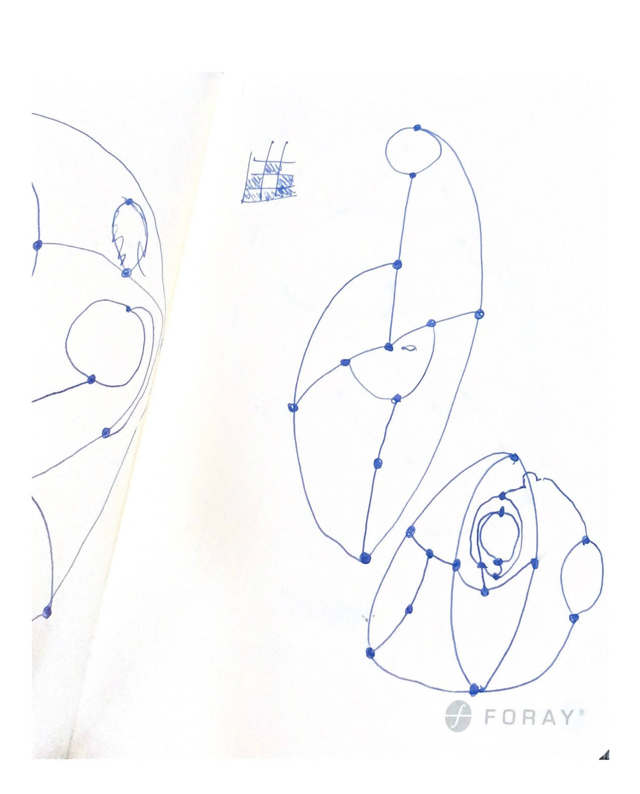
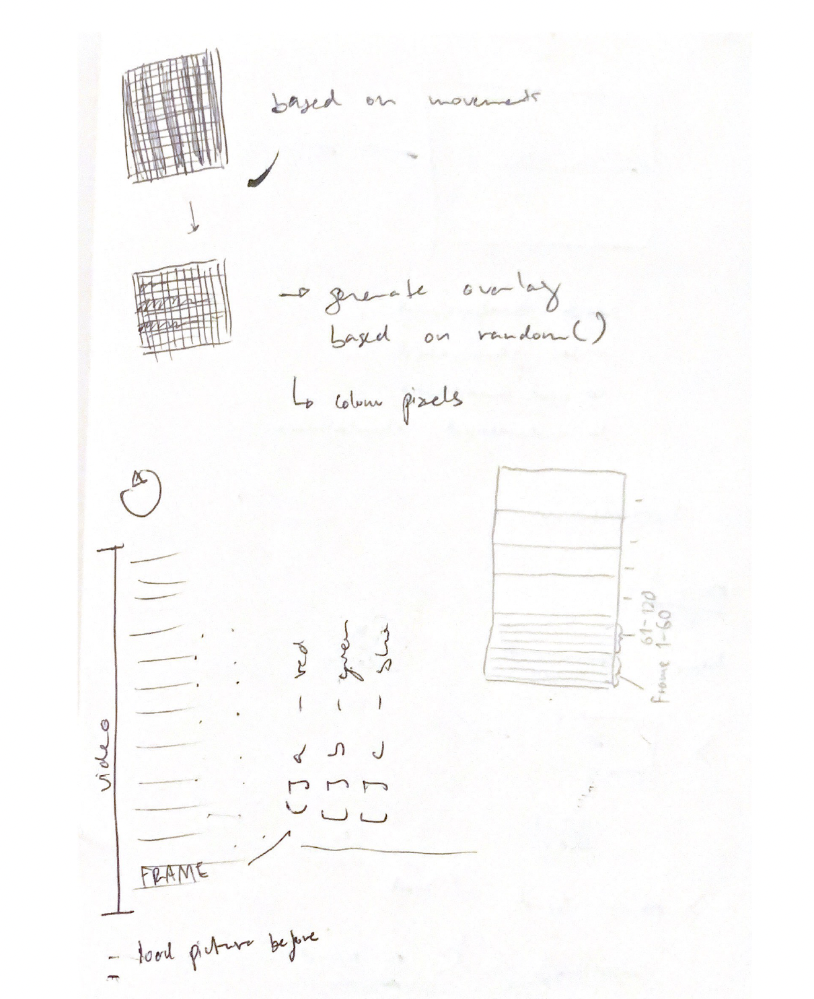
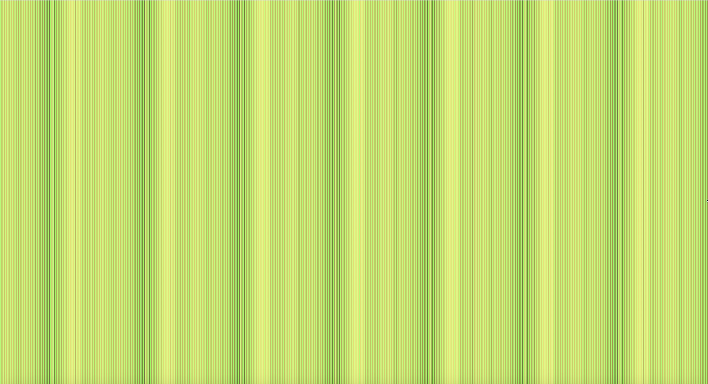

# Generative Computational Graphics - done in p5.js

## [Day 1](https://digitalideation.github.io/gencg_h2101/notes/day01/) 

### 
Kicked off day 1 with small Git and Git Pages introduction, to publish our process.

The Game Sprouts
Rules (copyed)
The game starts by drawing any number of spots. For example 3 spots. The first player has a turn by joining two of the spots and marking a new spot in the middle of the line. Or the line may start and end on the same spot.

You are not allowed to draw a line which crosses another line. A spot cannot have more than three lines leading to or from it. The idea is to make it impossible for the other player to draw a line. So the last person to draw a line is the winner.



Went abit ahead and created a camera based pixel visualization. First I visualized it on a paper.





```js
// var stepSize = floor(map(mouseX, 0, width, 3, 3));
for (var x = 0; x < video.width; x += stepSize) {
  for (var y = 0; y < video.height; y += stepSize) {
    var index = (video.width + x) * 30;
    // Filter code
    var redVal = video.pixels[index];
    var greenVal = video.pixels[index + 1];
    var blueVal = video.pixels[index + 2];
    // remove the stroke
    noStroke();
    // change the colors
    fill(redVal, greenVal, blueVal);
    // change the shape of the 'pixels'
    rectMode(CENTER);
    rect(x, y, stepSize, stepSize);
    //circle(x, y, stepSize, stepSize);
  }
}
}
```
---

## [Day 2](https://digitalideation.github.io/gencg_h2101/notes/day02/) 

### 
Second day was based on a grid challenge, where I used a repetitive loop which reproduces circles in round alignment infinitly. 


---

## [Day 3](https://digitalideation.github.io/gencg_h2101/notes/day03/) 

### 
Clock-o-day, I lacked some inspiration to use real-time to display a clock system. 


## Computing with computer

Lorem ipsum dolor sit amet, consetetur sadipscing elitr, sed diam nonumy eirmod tempor invidunt ut labore et dolore magna aliquyam erat, sed diam voluptua. At vero eos et accusam et justo duo dolores et ea rebum. Stet clita kasd gubergren, no sea takimata sanctus est Lorem ipsum dolor sit amet. Lorem ipsum dolor sit amet, consetetur sadipscing elitr, sed diam nonumy eirmod tempor invidunt ut labore et dolore magna aliquyam erat, sed diam voluptua.

> At vero eos et accusam et justo duo dolores et ea rebum. Stet clita kasd gubergren, no sea takimata sanctus est Lorem ipsum dolor sit amet. Lorem ipsum dolor sit amet, consetetur sadipscing elitr, sed diam nonumy eirmod tempor invidunt ut labore et dolore magna aliquyam erat, sed diam voluptua.

* Lorem ipsum dolor sit amet
* Consetetur sadipscing elitr, sed diam nonumy.
* At vero eos et accusam et justo duo dolores et ea rebum. 
