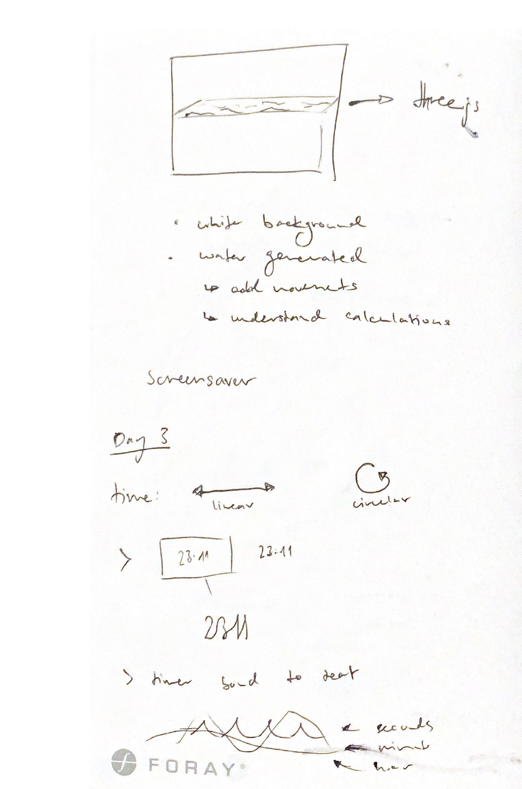
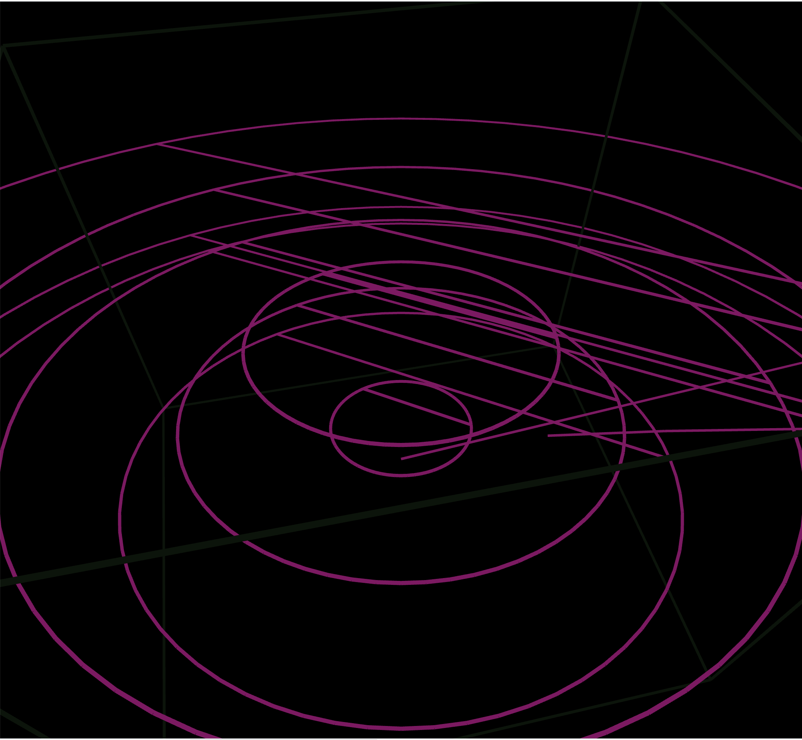
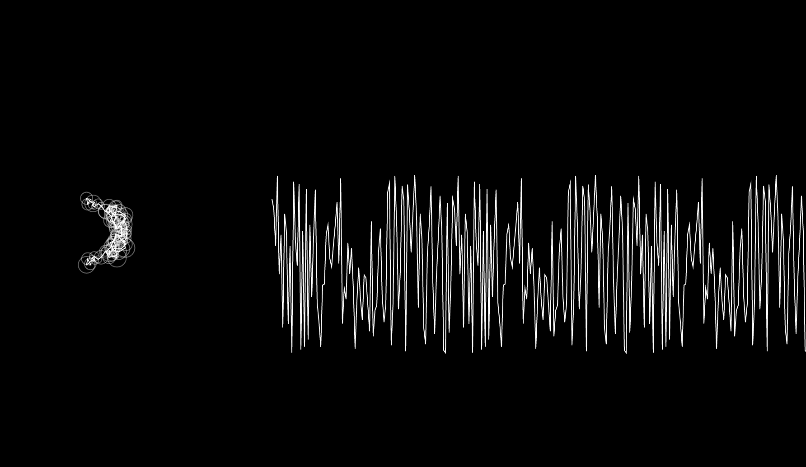
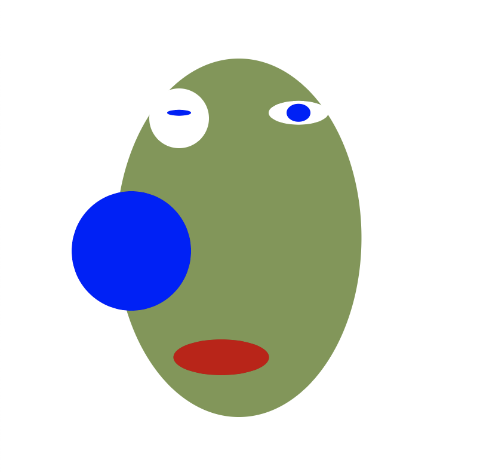
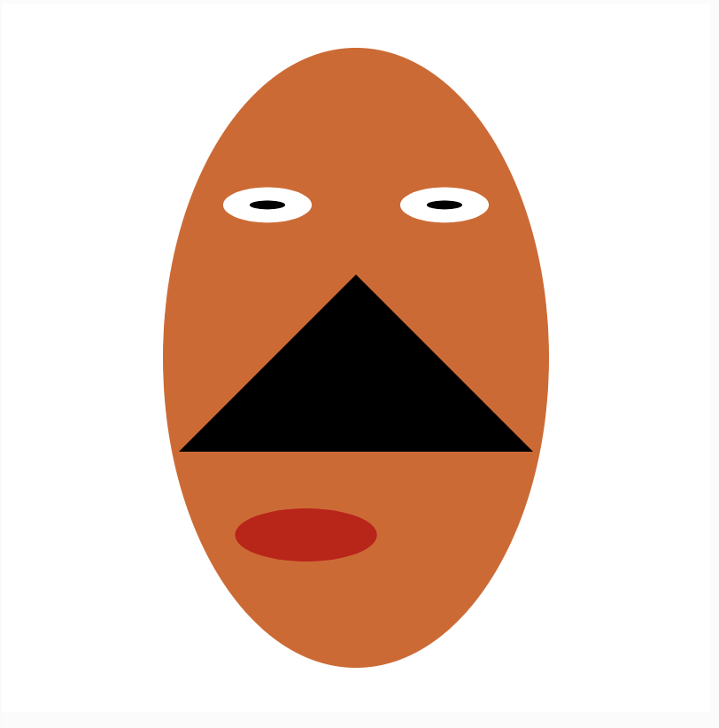
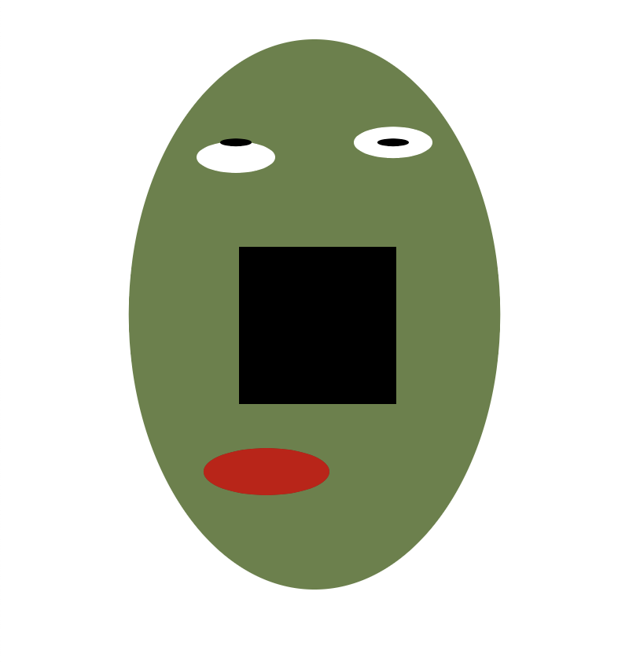
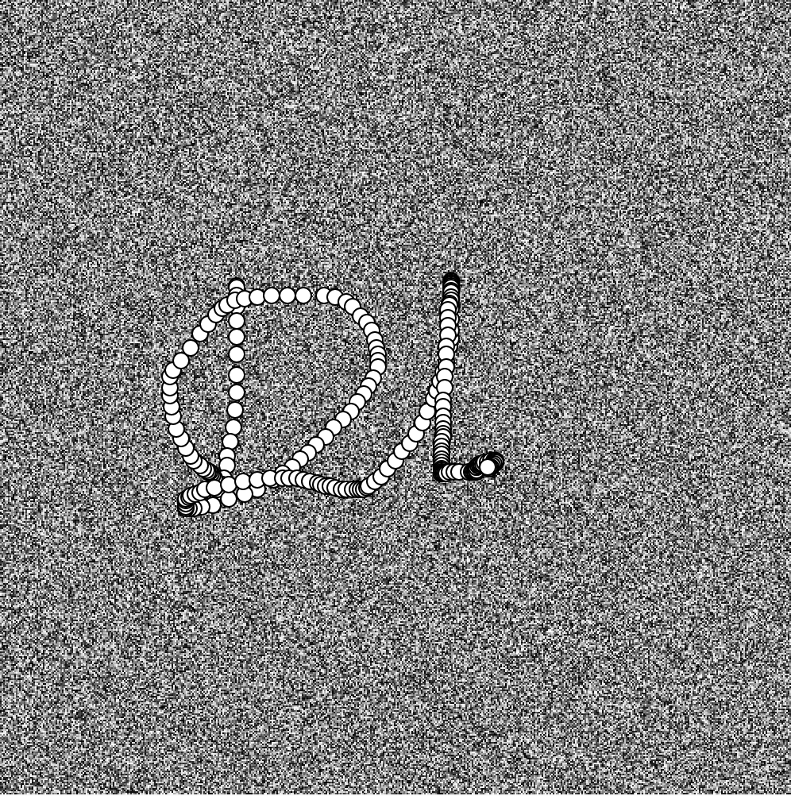
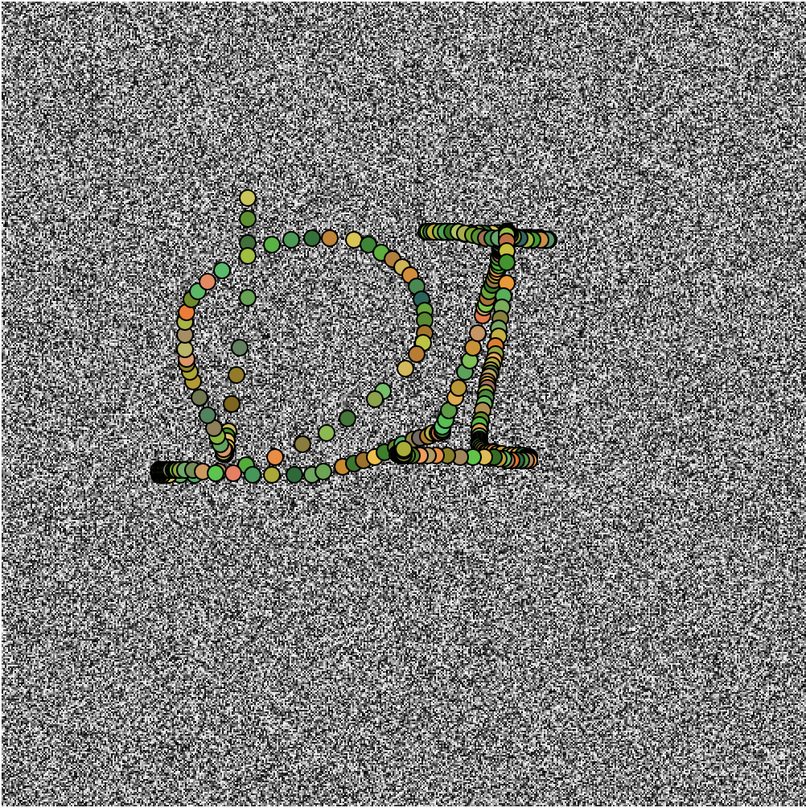
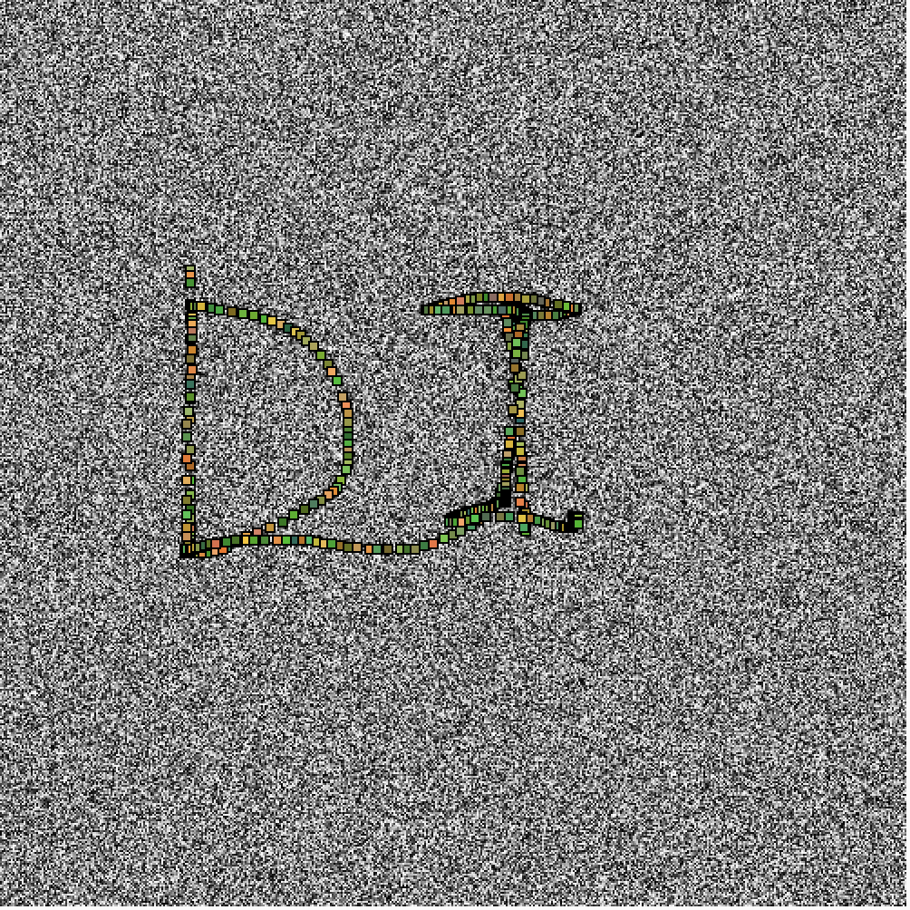
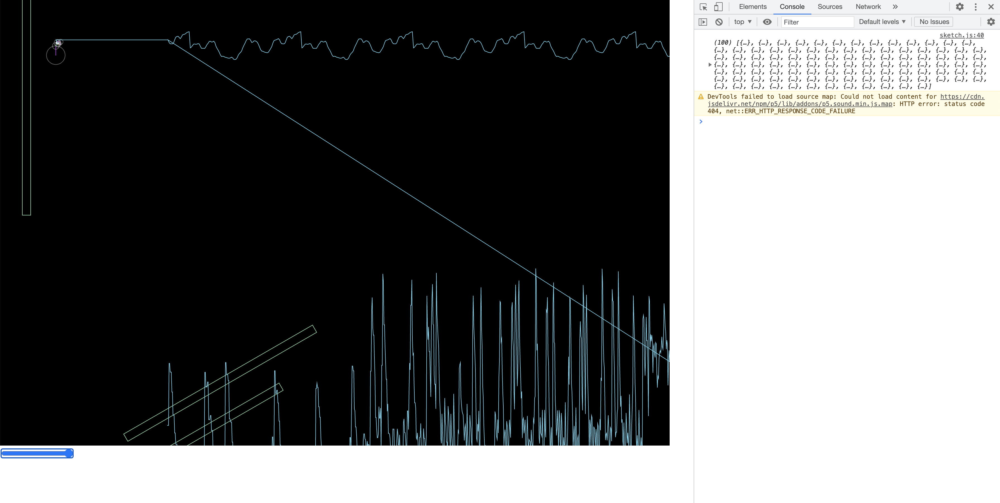

# Generative Computational Graphics - done in p5.js

## [Day 1](https://digitalideation.github.io/gencg_h2101/notes/day01/) 

### 
Kicked off day 1 with small Git and Git Pages introduction, to publish our process.

The Game Sprouts
Rules (copyed)
The game starts by drawing any number of spots. For example 3 spots. The first player has a turn by joining two of the spots and marking a new spot in the middle of the line. Or the line may start and end on the same spot.

You are not allowed to draw a line which crosses another line. A spot cannot have more than three lines leading to or from it. The idea is to make it impossible for the other player to draw a line. So the last person to draw a line is the winner.


Went abit ahead and created a camera based pixel visualization. First I visualized it on a paper.


```js
// var stepSize = floor(map(mouseX, 0, width, 3, 3));
for (var x = 0; x < video.width; x += stepSize) {
  for (var y = 0; y < video.height; y += stepSize) {
    var index = (video.width + x) * 30;
    // Filter code
    var redVal = video.pixels[index];
    var greenVal = video.pixels[index + 1];
    var blueVal = video.pixels[index + 2];
    // remove the stroke
    noStroke();
    // change the colors
    fill(redVal, greenVal, blueVal);
    // change the shape of the 'pixels'
    rectMode(CENTER);
    rect(x, y, stepSize, stepSize);
    //circle(x, y, stepSize, stepSize);
  }
}
}
```
---

## [Day 2](https://digitalideation.github.io/gencg_h2101/notes/day02/) 

### 
Second day was based on a grid challenge, where I used a repetitive loop which reproduces circles in round alignment infinitly. 


---

## [Day 3](https://digitalideation.github.io/gencg_h2101/notes/day03/) 

### 
Clock-o-day, I lacked some inspiration to use real-time to display a clock system. My first attempt included waves however I decided to go against it. 





---

## [Day 4](https://digitalideation.github.io/gencg_h2101/notes/day04/) 

### 
Creating a machine with a user input, I however tried to extend the challenge to write the fourier transformation algorithm with @codingtrain and to understand each step. On day 4 it still didn't work as how it should, however I kept working on it as a main project on day 6-8.



---

## [Day 5](https://digitalideation.github.io/gencg_h2101/notes/day05/) 

### 
Face generator where the user can interact with a click to generate newer faces. By clicking on the image, a new nose is displayed with a random geometric object.





## [Day 6](https://digitalideation.github.io/gencg_h2101/notes/day06/) 

### 
Pixel generation by displaying a broken tv screen. Added some interaction, whenever user clicks on the screen he's able to drag along and draw on it. 





## [Day 7&8](https://digitalideation.github.io/gencg_h2101/notes/day07/) 

### 
I continued working on the fourier transformation from week 4 and was able to finish it. After writing the algorithm I added an own sound, where the user can interact based on the base volume with the drawn amplitudes.



